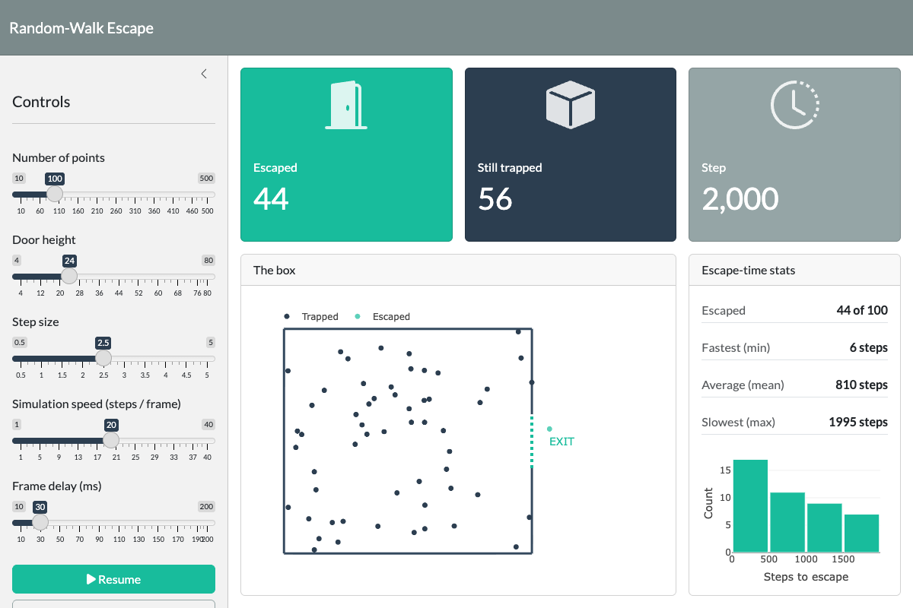

# 09. Random-Walk Escape — a live Shiny animation

A fun reference app that answers a simple question with a surprisingly rich
statistical answer: **trap 100 points in a box, let each take a random step in a
random direction every tick, and watch how long it takes them all to find the
single exit.**

It exists to show that a smooth, real-time particle animation — 100+ points
updating ~25×/second — is achievable in **plain R/Shiny libraries**, no custom
JavaScript required. The whole thing is `shiny` + `bslib` + `plotly`.



## What it does

- 100 points start scattered inside a square box and **random-walk**, reflecting
  off the four walls.
- The right wall has one **door** (the teal gap). A point that wanders into it
  **escapes** and drifts off-screen.
- Live counters show **escaped / still-trapped / step number**.
- As points escape, it tracks the **escape-time distribution** — fastest (min),
  average (mean), slowest (max) — and builds a live histogram.
- Runs until the box is empty.

All controls are live: swarm size, door height, step size, and two speed knobs
(steps simulated per rendered frame, and the frame delay).

## How it works — the techniques on show

| Technique | Where |
|-----------|-------|
| **Real-time animation without JS** | `observe()` + `invalidateLater()` self-re-arming loop in `server.R` |
| **Smooth updates, no full redraw** | `plotlyProxy()` + `restyle` pushes only new x/y to the two `scattergl` traces each frame (`server.R`, `update`/restyle block) |
| **Decoupled render cadence** | "steps per frame" advances the physics N times per single browser repaint, so the sim can run fast while drawing cheaply |
| **Pure, testable physics** | all the maths lives in `R/sim_engine.R` with zero Shiny, so it unit-tests in isolation |
| **Event-driven analytics** | stats + histogram depend on an `escape_tick` counter that bumps *only* when a point escapes — they don't re-render every frame |

### The performance trick that matters

A naive version re-renders the whole `plotly` figure every tick (`renderPlotly`
in a timer) and stutters badly at 100 points. This app renders the figure
**once** (`output$arena`), then for every frame issues a single
`plotlyProxyInvoke(proxy, "restyle", ...)` that swaps the x/y arrays of the
"trapped" and "escaped" traces. The walls, axes, and labels are never redrawn.

### Why `scaleanchor` is *not* used

The arena looks square, but it does **not** set `yaxis$scaleanchor`. Combined
with two fixed axis ranges, `scaleanchor` makes plotly zoom into a tiny
sub-window (early on, only the EXIT label rendered while the box fell
off-screen). The fix is to honour explicit fixed ranges proportioned to read
roughly square — see the note in `R/plot_arena.R`.

## The interesting finding

Escape via pure 2D diffusion to a small opening has a **heavy right tail**. With
the defaults you'll routinely see the *mean* escape time around a few hundred
steps while the *max* is several thousand — the bulk of the swarm pours out
quickly and then a few unlucky stragglers rattle around for ages. The min/mean/max
panel and the skewed histogram make that gap visible. (This is also why the unit
test for "the box eventually empties" uses a small swarm and a wide door — the
tail makes a tight step-cap unreliable, which is the point.)

## Run it

```bash
NOT_CRAN=true Rscript -e 'source("renv/activate.R"); shiny::runApp("examples/09. annimation")'
```

## Files

```
09. annimation/
  global.R              # packages, constants, palette, source()s
  ui.R                  # page_sidebar: controls, value boxes, arena, stats/hist
  server.R             # the animation loop + reactive wiring
  R/
    sim_engine.R       # pure physics: new_swarm(), advance(), escape_summary()
    plot_arena.R       # box_shapes(), arena_base() — plotly rendering
  tests/testthat/
    test-sim-engine.R  # 23 unit tests for the physics
    test-app-smoke.R   # AppDriver: launches, animates, pauses, resets, no errors
    helper-shiny-smoke.R
    setup.R
```

## Testing notes

- **Unit tests** cover the physics directly (reflection keeps trapped points
  inside; a point aimed at the door escapes; one aimed at solid wall reflects;
  escaped points drift; the summary maths; a full run terminates).
- **Smoke test** (Acceptance Gate) launches the real app and exercises the
  headline interaction. One gotcha worth knowing: **while the animation runs,
  `invalidateLater` keeps Shiny perpetually busy, so `app$wait_for_idle()` never
  returns.** The test starts the sim with a plain `Sys.sleep()`, then **pauses**
  before any `wait_for_idle()` so the reactive graph can settle.

Run:

```bash
NOT_CRAN=true Rscript -e '
  source("renv/activate.R"); setwd("examples/09. annimation")
  library(shinytest2); testthat::test_dir("tests/testthat")'
```
